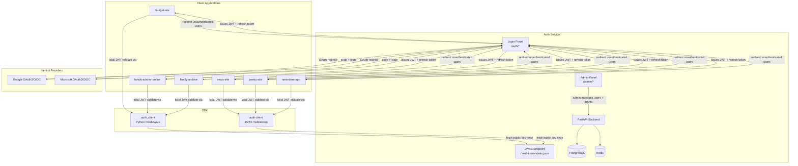
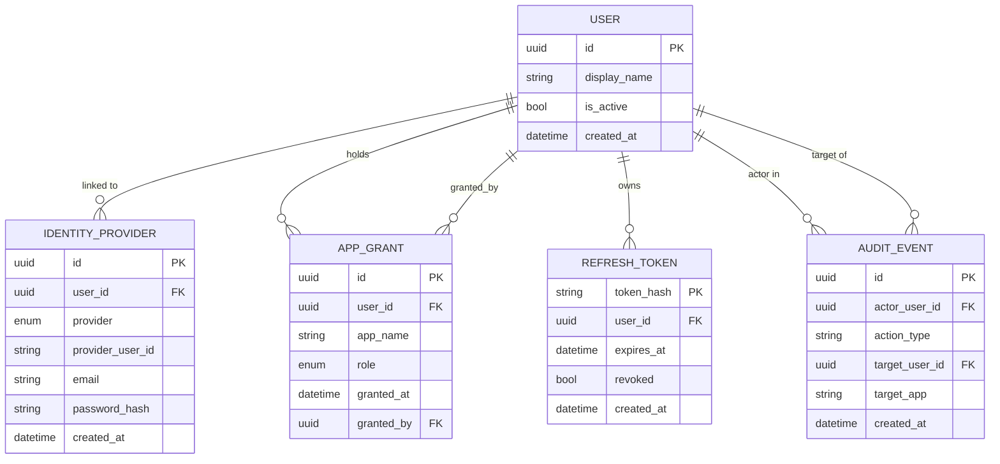

# Centralised Authentication Service — Full Description

**Version**: 1.0 (spec branch `001-centralised-auth-service`)
**Status**: Design complete, implementation pending
**Repository**: `web-projects/auth-service/`

---

## 1. Purpose

The six applications in the `web-projects` platform — **budget-site**, **family-admin-routine**, **family-archive**, **news-site**, **poetry-site**, and **reminders-app** — each maintain their own authentication code. This creates duplicated logic, inconsistent security postures, and no central way to manage who can access which application.

The Centralised Authentication Service replaces all six ad-hoc implementations with a single, security-focused identity platform. After migration, no client application contains login forms, password hashing, or session management of its own. Every app delegates authentication to this service and enforces access by validating a signed token locally.

---

## 2. Architecture Overview



The service is a **single deployable unit** (monolith-by-design for this scale). The backend is a FastAPI application; the admin panel is a standalone React SPA served by the same deployment. Client applications never call the auth service for routine token validation — they validate locally using the cached public JWKS key, making per-request auth overhead under 10 ms and keeping the service out of the hot path.

---

## 3. Authentication Strategies

### 3.1 Google OAuth 2.0 / OIDC

1. Client app redirects the unauthenticated user to `GET /auth/login/google`.
2. The auth service generates a PKCE code verifier/challenge, stores an opaque `state` parameter in Redis (10-minute TTL), and redirects the user to Google's authorisation endpoint.
3. Google redirects back to `GET /auth/callback/google?code=…&state=…`.
4. The auth service validates `state`, exchanges `code` for tokens using PKCE, fetches the OIDC userinfo, upserts the `User` and `IdentityProvider` records, and issues an access + refresh token pair.
5. The user is redirected to the originating app with the access token.

### 3.2 Microsoft OAuth 2.0 / OIDC

Identical flow to Google, via `GET /auth/login/microsoft` and `GET /auth/callback/microsoft`. The authlib library handles OIDC discovery for both providers.

### 3.3 Username / Password (Local Strategy)

1. The user submits `POST /auth/login` with `email` and `password`.
2. The backend fetches the `IdentityProvider` record for `provider=local` by email.
3. passlib verifies the submitted password against the stored bcrypt hash (work factor ≥ 12).
4. On success, an access + refresh token pair is issued.
5. After three failed attempts within 60 seconds (tracked in Redis), the account is temporarily locked. The error response does not reveal whether the email exists.

### 3.4 Account Linking

A user may link multiple identity providers to a single account. Linking is keyed on `(provider, provider_user_id)` — not email — to survive provider-side email changes. Auto-merging accounts on email match alone is forbidden; explicit confirmation is required.

---

## 4. Token Strategy

### 4.1 Access Token (JWT, RS256)

| Field | Value |
|-------|-------|
| Algorithm | RS256 (asymmetric) |
| TTL | ≤ 15 minutes (configurable) |
| Signing key | RSA private key loaded from environment variable |
| Public key distribution | `/.well-known/jwks.json` |

**Payload claims**:

```json
{
  "sub": "uuid-of-user",
  "display_name": "Alice",
  "grants": ["budget-site", "news-site"],
  "role": "user",
  "exp": 1234567890,
  "iat": 1234567000,
  "kid": "key-id-for-rotation"
}
```

The `grants` claim lists the applications the user currently has an active `AppGrant` for. Client apps check this claim locally — no round-trip to the auth service required for authorisation.

### 4.2 Refresh Token (Opaque, Redis-backed)

| Field | Value |
|-------|-------|
| Format | Cryptographically random 32-byte string |
| Storage | Redis, key: `rt:{user_id}:{token_hash_prefix}`, TTL: 30 days |
| Delivery | `HttpOnly; Secure; SameSite=Strict` cookie |
| Rotation | Every use — old token deleted, new token issued atomically |

**Refresh token theft detection**: If an already-rotated (absent) refresh token is presented, the service deletes all remaining refresh token keys for that user ID, forcing a full re-authentication across all sessions.

### 4.3 JWKS Key Rotation

Each signing key carries a `kid` (key ID) in the JWT header. When the private key is rotated:
1. A new key pair is generated with a new `kid`.
2. The old public key remains in the JWKS response for one TTL window (15 minutes) so in-flight tokens issued with the old key remain valid.
3. Clients that cache JWKS re-fetch on a `kid` miss.

---

## 5. Per-Application Access Control (RBAC)

### 5.1 Data Model

```
User ──< AppGrant >── (app_name, role)
```

An `AppGrant` row is an explicit permission. Its absence means **no access** (deny-by-default). Roles are:
- `user` — can use the application
- `admin` — can use the application and access the admin panel of the auth service

### 5.2 Grant Enforcement

**At token issuance**: The `grants` claim in the access token is built from the user's current `AppGrant` rows.

**At the client app**: The SDK middleware decodes the access token locally (using the cached JWKS public key), checks that the target app's name appears in the `grants` claim, and either passes the request with the decoded `user` object injected, or returns 403.

**Grant change propagation**: When an admin revokes a grant, the change does not invalidate the current access token (stateless JWTs cannot be revoked mid-flight). The revocation takes effect within one TTL window (≤ 15 minutes) when the client presents the refresh token to get a new access token — the new token is issued without the revoked app's grant.

---

## 6. Data Model



**Entity notes**:
- `IDENTITY_PROVIDER.password_hash` is only set for `provider=local` rows.
- `REFRESH_TOKEN` is stored as the SHA-256 hash of the raw token, never the raw value.
- `AUDIT_EVENT` is append-only; no update or delete operations are permitted on this table.
- `APP_GRANT.app_name` matches the string identifier used in the `grants` JWT claim and in SDK configuration (`APP_NAME` env var).

---

## 7. API Reference

### 7.1 Authentication Endpoints (`/auth`)

| Method | Path | Description | Auth required |
|--------|------|-------------|---------------|
| GET | `/auth/login/{provider}` | Initiate OAuth2 flow (provider: `google`, `microsoft`) | No |
| GET | `/auth/callback/{provider}` | OAuth2 callback — issues tokens, redirects | No |
| POST | `/auth/login` | Local login (`email`, `password`) | No |
| POST | `/auth/refresh` | Rotate refresh token, issue new access token | Refresh cookie |
| POST | `/auth/logout` | Revoke current refresh token | Refresh cookie |

### 7.2 JWKS Endpoint

| Method | Path | Description |
|--------|------|-------------|
| GET | `/.well-known/jwks.json` | Public RSA key(s) for token verification |

### 7.3 Admin Endpoints (`/admin`) — `admin` role required

| Method | Path | Description |
|--------|------|-------------|
| GET | `/admin/users` | Paginated list of users with grants + identity providers |
| GET | `/admin/users/{user_id}` | Single user detail |
| POST | `/admin/grants` | Create an AppGrant (`user_id`, `app_name`, `role`) |
| DELETE | `/admin/grants/{grant_id}` | Revoke an AppGrant |
| GET | `/admin/audit` | Paginated immutable audit log |

All admin endpoints require a valid access token with `role=admin` in the JWT claims. A 403 is returned if the claim is absent or the token is invalid.

---

## 8. Admin Panel

The admin panel is a React SPA served at `/admin/`. It is the primary operational interface for non-technical administrators.

### 8.1 Login Flow

The admin logs in via the standard login page (`/auth/login`). The access token is stored in-memory (React state); the refresh token is held in an `HttpOnly` cookie. The SPA auto-refreshes the access token via `POST /auth/refresh` when the API returns 401.

### 8.2 Features

**User List** (`/admin/users`)
- Paginated table of all registered users.
- Columns: display name, linked identity providers (with provider badges), per-app grant status (coloured chips), last active.
- Search by name or email.

**User Detail** (`/admin/users/:id`)
- Full user profile: display name, all linked identity providers, registration date.
- App access matrix: one checkbox per application, reflecting current `AppGrant` rows.
- Toggling a checkbox issues `POST /admin/grants` or `DELETE /admin/grants/{id}` and updates optimistically.

**Audit Log** (`/admin/audit`)
- Immutable read-only timeline of all grant/revoke actions.
- Columns: timestamp, acting admin, affected user, action type, target application.
- Filterable by date range, actor, or target user.

### 8.3 Access Control

The admin route is protected at two levels:
1. React Router guard: if the decoded JWT does not contain `role=admin`, the user is redirected to the login page.
2. Backend guard: every `/admin/*` endpoint verifies the `admin` role claim from the JWT. Client-side checks alone are never trusted.

---

## 9. Client SDK

Two thin integration libraries are distributed from the `sdk/` directory.

### 9.1 Python SDK (`sdk/python/auth_client`)

Designed for FastAPI and Django apps.

**Installation**:
```bash
pip install auth_client @ git+https://…/auth-service.git#subdirectory=sdk/python
```

**FastAPI integration**:
```python
from auth_client.middleware import require_auth

@app.get("/protected")
async def protected(user = Depends(require_auth(app_name="budget-site"))):
    return {"user": user.display_name}
```

**Django middleware** (`settings.py`):
```python
MIDDLEWARE = [
    "auth_client.middleware.DjangoAuthMiddleware",
    ...
]
AUTH_SERVICE_URL = "https://auth.example.com"
AUTH_APP_NAME = "family-archive"
```

On every request, the middleware:
1. Extracts the `Authorization: Bearer <token>` header.
2. Validates the RS256 JWT signature using the cached JWKS public key (cache TTL: 5 minutes).
3. Checks that `app_name` is present in the `grants` claim.
4. Injects the decoded user object into `request.user` (Django) or the FastAPI dependency.
5. Returns 401 for an invalid/expired token; 403 for a valid token missing the app grant.

**JWKS cache behaviour**: The public key is fetched from `/.well-known/jwks.json` on first use and cached. On a `kid` mismatch (key rotation), the cache is invalidated and the key re-fetched once. The auth service is never contacted on normal requests.

### 9.2 JavaScript / TypeScript SDK (`sdk/js`)

Designed for Express and Next.js apps.

**Installation**:
```bash
npm install auth-client@file:../../auth-service/sdk/js
```

**Express**:
```typescript
import { authMiddleware } from "auth-client";

app.use(authMiddleware({ appName: "news-site", authServiceUrl: "https://auth.example.com" }));
```

**Next.js** (middleware.ts):
```typescript
import { validateToken } from "auth-client";

export async function middleware(req: NextRequest) {
  const result = await validateToken(req, { appName: "reminders-app" });
  if (!result.ok) return NextResponse.json({ error: result.reason }, { status: result.status });
}
```

---

## 10. Security Model

### 10.1 Threat Mitigations

| Threat | Mitigation |
|--------|-----------|
| Password brute-force | Rate limiting (3 attempts / 60 s), account lock, no username enumeration |
| Refresh token theft | Rotation on every use; reuse detection triggers full session revocation |
| CSRF on OAuth callback | PKCE + opaque `state` parameter stored in Redis with 10-min TTL |
| JWT forgery | RS256 asymmetric signing; private key never leaves the backend |
| Admin endpoint abuse | JWT `role=admin` claim checked server-side on every request |
| XSS token theft | Access token in memory only; refresh token in `HttpOnly; Secure; SameSite=Strict` cookie |
| Open redirect | Post-login redirect URIs validated against a per-app allowlist |
| SQL injection | SQLAlchemy ORM with parameterised queries; no raw SQL |
| Secret leakage | All secrets via environment variables; `.env.example` documents keys, never values |

### 10.2 Password Storage

Local passwords are hashed using bcrypt with a work factor of **12** (minimum). No plain-text or reversibly-encrypted passwords are stored at any point. The `password_hash` column is NULL for OAuth-only accounts.

### 10.3 Transport Security

- HTTPS is enforced in production via HSTS header.
- The refresh token cookie carries `Secure` and `SameSite=Strict` attributes.
- CORS is configured to allow only the registered client app origins.

### 10.4 Audit Trail

Every admin action (grant, revoke) writes an immutable `AuditEvent` record synchronously within the same database transaction. Audit records cannot be deleted through any API endpoint.

---

## 11. Deployment

### 11.1 Local Development

```bash
cp .env.example .env          # fill in GOOGLE_CLIENT_ID, MICROSOFT_CLIENT_ID, etc.
docker-compose up --build
```

Services started:
- `auth-backend` on port 8000 (FastAPI + uvicorn)
- `auth-frontend` on port 3000 (Vite dev server)
- `postgres` on port 5432
- `redis` on port 6379

First start: if `SEED_ADMIN_EMAIL` and `SEED_ADMIN_PASSWORD` are set, a seed admin account is created automatically.

### 11.2 Environment Variables

| Variable | Required | Description |
|----------|----------|-------------|
| `DATABASE_URL` | Yes | PostgreSQL DSN |
| `REDIS_URL` | Yes | Redis DSN |
| `JWT_PRIVATE_KEY` | Yes | RSA private key (PEM, base64-encoded) |
| `GOOGLE_CLIENT_ID` | Yes | Google OAuth2 client ID |
| `GOOGLE_CLIENT_SECRET` | Yes | Google OAuth2 client secret |
| `MICROSOFT_CLIENT_ID` | Yes | Microsoft OAuth2 client ID |
| `MICROSOFT_CLIENT_SECRET` | Yes | Microsoft OAuth2 client secret |
| `SEED_ADMIN_EMAIL` | Optional | Bootstrap admin email (first start only) |
| `SEED_ADMIN_PASSWORD` | Optional | Bootstrap admin password (first start only) |
| `ACCESS_TOKEN_TTL_MINUTES` | Optional | Default: 15 |
| `ALLOWED_REDIRECT_URIS` | Yes | Comma-separated allowlist of post-login redirect URIs |

### 11.3 Production Deployment

Target: Linux server (single region). Deployment mechanism is TBD (Docker / docker-compose, or a small VM with systemd). Database and Redis may be managed services.

---

## 12. Client Application Migration

### 12.1 Migration Steps (per app)

1. Add `AUTH_SERVICE_URL` and `APP_NAME` to the app's environment configuration.
2. Install the appropriate SDK (`auth_client` for Python, `auth-client` for JS).
3. Replace the existing authentication middleware/decorator with the SDK equivalent.
4. Remove the old auth module, login views, password-hashing utilities, and session tables.
5. Run the test suite; confirm protected routes still gate correctly.
6. Deploy and verify with a real user login.

### 12.2 Migration Order

Apps can be migrated in parallel after the auth service (Phases 1–5) is fully operational. The recommended pilot is **budget-site** as the simplest Python app.

### 12.3 Zero Account Migration

Existing per-app user records do not need to be imported. Users re-authenticate via the new flow on first use (OAuth or password). The auth service creates a new `User` record on first successful login. App-specific user data (budgets, entries, etc.) remains in each app's own database; the auth service provides only the identity and access layer.

---

## 13. Functional Requirements Reference

| ID | Requirement |
|----|------------|
| FR-001 | Authenticate users via Google OAuth 2.0 / OIDC |
| FR-002 | Authenticate users via Microsoft OAuth 2.0 / OIDC |
| FR-003 | Authenticate users via username + bcrypt-hashed password |
| FR-004 | Issue short-lived signed JWT access token (≤ 15 min TTL) |
| FR-005 | Issue opaque refresh token stored server-side, rotated on every use |
| FR-006 | Expose JWKS endpoint for stateless client-side JWT validation |
| FR-007 | Enforce per-application access grants; reject missing grants with 403 |
| FR-008 | Admin panel accessible only to users with `admin` role |
| FR-009 | Admin panel lists all users, their identity providers, and grants |
| FR-010 | Admin panel allows real-time grant/revoke per user per application |
| FR-011 | Immutable audit log for every grant/revoke action |
| FR-012 | Detect refresh token reuse; revoke all sessions for affected user |
| FR-013 | Rate-limit login and token-refresh endpoints |
| FR-014 | Provide SDK/middleware for client apps (single-call integration) |
| FR-015 | Seed admin account via environment variable for initial setup |

---

## 14. Success Criteria

| ID | Criterion | Target |
|----|-----------|--------|
| SC-001 | End-to-end OAuth login and redirect | < 5 s on standard connection |
| SC-002 | Username/password login response | < 2 s |
| SC-003 | Token validation by client app | < 10 ms, no network call |
| SC-004 | Concurrent login/refresh load | 200 req/s, < 0.1% error rate |
| SC-005 | Grant/revoke takes effect | Within 15 min (one TTL window) |
| SC-006 | Audit log latency | Within 1 s of action |
| SC-007 | Client app migration | All 6 apps, zero user account loss |
| SC-008 | No residual auth logic in client apps | 0 login forms / password hashing / session mgmt |

---

## 15. Project Structure

```
auth-service/
├── backend/
│   ├── src/
│   │   ├── main.py                    # FastAPI app factory + startup (seed admin)
│   │   ├── config.py                  # pydantic-settings; all env vars
│   │   ├── db/
│   │   │   ├── base.py
│   │   │   └── migrations/            # Alembic migration scripts
│   │   ├── models/
│   │   │   ├── user.py
│   │   │   ├── identity_provider.py
│   │   │   ├── app_grant.py
│   │   │   ├── refresh_token.py
│   │   │   └── audit_event.py
│   │   ├── services/
│   │   │   ├── auth_service.py        # Login, token issue, refresh, revocation
│   │   │   ├── oauth_service.py       # Google + Microsoft flows (authlib)
│   │   │   ├── token_service.py       # JWT RS256 sign/verify + JWKS payload
│   │   │   ├── grant_service.py       # AppGrant CRUD + AuditEvent writes
│   │   │   └── audit_service.py       # Audit log queries
│   │   ├── api/
│   │   │   ├── auth.py                # /auth/* routes
│   │   │   ├── jwks.py                # /.well-known/jwks.json
│   │   │   └── admin.py               # /admin/* routes
│   │   └── middleware/
│   │       └── rate_limit.py          # Redis sliding-window rate limiter
│   ├── tests/
│   │   ├── integration/               # Full stack: DB + Redis
│   │   └── unit/
│   ├── pyproject.toml
│   └── Dockerfile
│
├── frontend/
│   ├── src/
│   │   ├── pages/
│   │   │   ├── Login.tsx
│   │   │   ├── UserList.tsx
│   │   │   ├── UserDetail.tsx
│   │   │   └── AuditLog.tsx
│   │   ├── components/
│   │   │   ├── GrantToggle.tsx
│   │   │   └── ProviderBadge.tsx
│   │   └── services/
│   │       └── api.ts                 # Axios wrapper + auto-refresh on 401
│   ├── package.json
│   └── Dockerfile
│
├── sdk/
│   ├── python/                        # pip-installable; for FastAPI + Django apps
│   │   └── auth_client/
│   │       ├── middleware.py
│   │       ├── validator.py
│   │       └── jwks_cache.py
│   └── js/                            # npm package; for Express + Next.js apps
│       └── src/
│           ├── middleware.ts
│           └── validator.ts
│
├── docs/
│   ├── architecture.md
│   ├── api-spec.yaml                  # OpenAPI 3.1
│   ├── role-model.md
│   ├── migration-guide.md
│   └── adr/
│       ├── 001-monolith-vs-microservice.md
│       ├── 002-jwt-strategy.md
│       ├── 003-oauth-library.md
│       └── 004-sdk-vs-redirect.md
│
├── agents/
│   ├── architect/CLAUDE.md
│   ├── backend-developer/CLAUDE.md
│   ├── frontend-developer/CLAUDE.md
│   └── reviewer/CLAUDE.md
│
├── .claude/settings.json              # MCP: brainstorm + speckit
├── docker-compose.yml
├── .env.example
├── README.md
└── FULL_DESCRIPTION.md
```

---

## 16. Technology Stack

| Layer | Technology | Version | Rationale |
|-------|-----------|---------|-----------|
| Backend language | Python | 3.12 | Type hints, async support, team familiarity |
| Backend framework | FastAPI | 0.111 | Async-native, OpenAPI generation, Pydantic v2 |
| OAuth2 library | authlib | 1.3 | OIDC discovery, PKCE, state handling out of the box |
| JWT | python-jose | latest | RS256 sign/verify, JWKS generation |
| Password hashing | passlib[bcrypt] | latest | Industry standard; bcrypt work factor configurable |
| ORM | SQLAlchemy | 2.0 async | Type-safe queries; Alembic migration support |
| Database | PostgreSQL | 16 | ACID; UUID primary keys; JSON support |
| Session store | Redis | 7 | Fast TTL-based storage for refresh tokens + rate limits |
| Frontend framework | React | 18 | Concurrent mode; team familiarity |
| Build tool | Vite | latest | Fast HMR; TypeScript-first |
| Routing | React Router | 6 | Industry standard |
| Data fetching | TanStack Query | 5 | Cache, invalidation, optimistic updates |
| UI components | shadcn/ui + Tailwind | latest | Accessible, composable, dark/light mode |
| Frontend testing | Vitest + RTL | latest | Vite-native; DOM testing |
| Backend testing | pytest + httpx | latest | Async support; integration with FastAPI test client |
| Containerisation | Docker + Compose | latest | Local dev parity; production portability |

---

## 17. Out of Scope (v1)

- Mobile / native app support (iOS, Android) — web-only
- Email-based password reset — v1 uses admin-initiated resets only
- Two-factor authentication (2FA / MFA)
- Self-service account registration — new users are added by an admin granting access
- Per-app role definitions beyond `user` / `admin`
- SAML / enterprise SSO (other than Google Workspace / Microsoft Entra via OIDC)
- Multi-region or high-availability deployment
