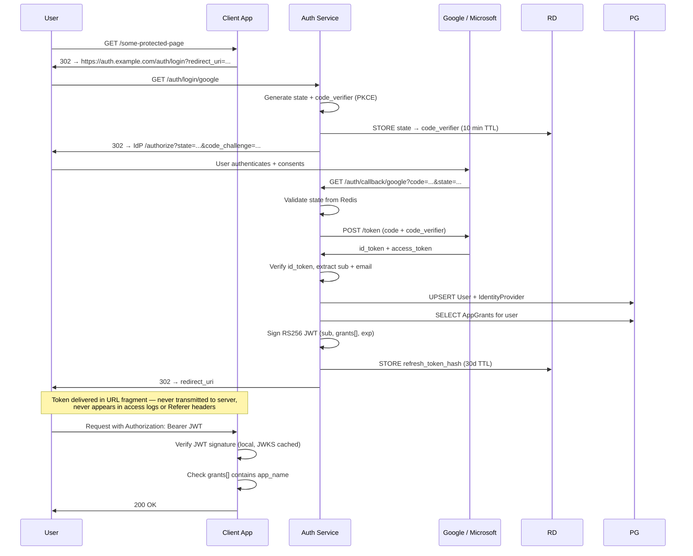
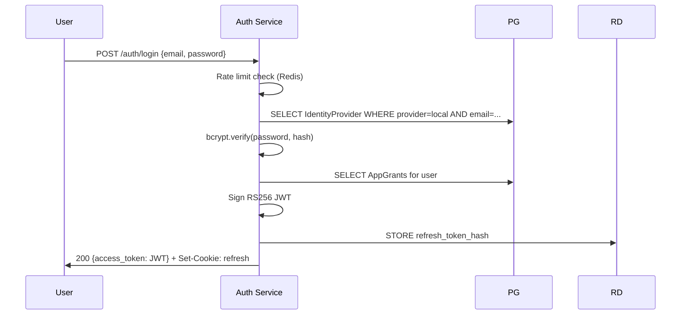
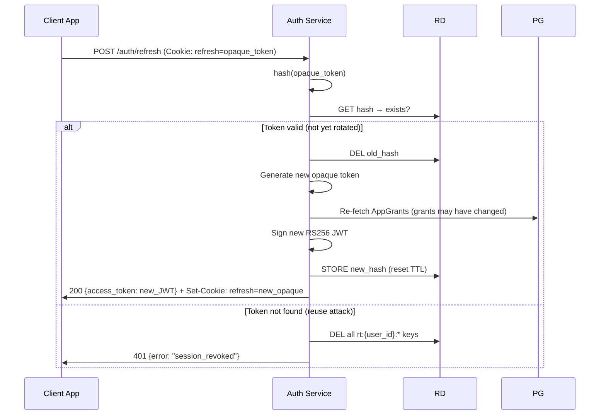
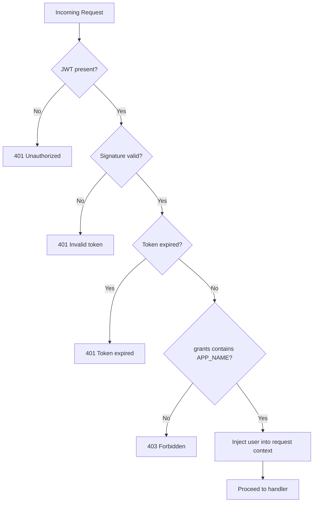

# Centralised Authentication Service — Architecture

**Version**: 1.0.0 | **Date**: 2026-05-09 | **Author**: Architect Agent

---

## System Overview

The centralised authentication service is the single source of truth for identity
and session state across all `web-projects` client applications. Every login flow,
token issuance, and access grant check is owned by this service.

```mermaid
graph TB
    subgraph Client Applications
        BS[budget-site]
        FA[family-admin-routine]
        FArchive[family-archive]
        NS[news-site]
        PS[poetry-site]
        RA[reminders-app]
    end

    subgraph Auth Service
        FE[Login Portal\nReact SPA]
        BE[FastAPI Backend\n:8000]
        AP[Admin Panel\nReact SPA]
    end

    subgraph Data Stores
        PG[(PostgreSQL 16\nUsers · Grants · Audit)]
        RD[(Redis 7\nRefresh Tokens\nRate Limits)]
    end

    subgraph Identity Providers
        GG[Google OIDC]
        MS[Microsoft OIDC]
    end

    BS -- "1. redirect to /auth/login" --> FE
    FA -- "1. redirect to /auth/login" --> FE
    NS -- "1. redirect to /auth/login" --> FE
    FE -- "2. submit credentials / OAuth" --> BE
    BE -- "3. OAuth 2.0 authorise" --> GG
    BE -- "3. OAuth 2.0 authorise" --> MS
    GG -- "4. id_token" --> BE
    MS -- "4. id_token" --> BE
    BE -- "5. write session" --> PG
    BE -- "5. store refresh token" --> RD
    BE -- "6. redirect with JWT" --> FE
    FE -- "7. redirect back with access_token" --> BS

    BS -- "validate JWT (local)" --> BS
    BS -- "read grants claim" --> BS

    AP -- "admin API calls" --> BE
    BE -- "read/write" --> PG

    subgraph SDK
        PY[auth_client\nPython middleware]
        JS[@auth-service/client\nJS middleware]
    end

    BS -- "uses" --> PY
    NS -- "uses" --> JS
```

---

## Service Boundaries

| Component | Technology | Responsibility |
|-----------|-----------|----------------|
| **FastAPI Backend** | Python 3.12 + FastAPI | Auth flows, token issuance, admin API, JWKS endpoint |
| **Login Portal** | React 18 + Vite | Hosted login UI; handles OAuth redirects and password form |
| **Admin Panel** | React 18 + Vite | User management, grant/revoke, audit log (admin-only) |
| **Python SDK** | `auth_client` pip package | FastAPI/Django middleware for Python client apps |
| **JS SDK** | `@auth-service/client` npm package | Express/Next.js middleware for JS client apps |
| **PostgreSQL** | PostgreSQL 16 | Users, identity providers, app grants, audit events |
| **Redis** | Redis 7 | Refresh token store, OAuth state, rate limit counters |

---

## Authentication Flows

### OAuth 2.0 / OIDC Flow (Google or Microsoft)



### Username / Password Flow



### Token Refresh Flow



---

## Token Strategy

| Property | Access Token | Refresh Token |
|----------|-------------|---------------|
| Format | RS256 signed JWT | Opaque random (256-bit) |
| Storage (server) | Stateless — not stored | Hash stored in Redis |
| Storage (client) | In-memory only | HttpOnly + Secure + SameSite=Strict cookie |
| TTL | 15 minutes | 30 days |
| Rotation | Issued fresh on refresh | Rotated on every use |
| Revocation | Wait for TTL expiry | Instant (delete from Redis) |
| Theft detection | N/A | Reuse of rotated token → revoke all sessions |

### JWT Claims

```json
{
  "sub": "user-uuid-v4",
  "grants": ["budget-site", "news-site"],
  "exp": 1715000000,
  "iat": 1714999100,
  "kid": "auth-key-1"
}
```

The `grants` array contains the names of all applications the user currently has
access to. Client middleware checks `grants.includes(APP_NAME)` locally — no
network round-trip required.

---

## Per-Application Access Control

Access is **deny-by-default**. A user with a valid JWT is still refused if their
`grants` claim does not contain the target application name.



Grant changes propagate within one access token TTL window (≤ 15 min). The
`grants` claim is re-computed from the database on every token refresh.

---

## Client Integration Pattern

Client apps integrate via a **thin middleware** (Python or JS SDK):

```python
# FastAPI example — budget-site
from auth_client import AuthMiddleware

app = FastAPI()
app.add_middleware(
    AuthMiddleware,
    app_name="budget-site",
    jwks_url="https://auth.example.com/.well-known/jwks.json",
)
```

The middleware:
1. Extracts the `Authorization: Bearer <token>` header
2. Fetches the JWKS public key (cached 5 min, rotated on `kid` mismatch)
3. Verifies RS256 signature and expiry locally
4. Checks `grants` claim contains `app_name`
5. Injects `request.user` (sub, grants) into the request context
6. Returns 401 / 403 on any failure — never silently passes

---

## Deployment Topology

```
                        ┌─────────────────────────────────────┐
                        │          Docker host                 │
                        │                                      │
  Browser ──────────────┼──► :3000  auth-frontend (Nginx)     │
  Browser (admin) ──────┼──► :3000  /admin/*                  │
  Client apps ──────────┼──► :8000  auth-backend (uvicorn)    │
                        │              │         │             │
                        │              ▼         ▼             │
                        │         :5432 PG  :6379 Redis        │
                        └─────────────────────────────────────┘
```

Production: Replace docker-compose with your orchestration layer (k8s, ECS, etc.),
add TLS termination at the load balancer, and use managed PostgreSQL + Redis.

---

## Emergency Access Revocation

When an admin needs to immediately force a user out of all applications (e.g., compromised
account, terminated user), the flow is:

1. Admin calls `POST /admin/users/{userId}/revoke-sessions` (Phase 5 endpoint)
2. Auth service calls `revoke_all_sessions(user_id)` → marks all `RefreshToken` rows revoked + deletes all `rt:{user_id}:*` Redis keys
3. User's current access tokens remain valid until their 15-min TTL expires
4. On the next token refresh attempt, the user gets 401 and must re-authenticate
5. On re-authentication, the new JWT will reflect current grants (i.e., the revoked grant is absent)

For truly immediate revocation (< 15 min window), the operator must rotate the RS256
signing key (`jwt_key_id` → new value). All tokens signed with the old `kid` will be
rejected by client apps that have fetched the updated JWKS. Document this in the ops runbook.

## Security Decisions Summary

| Decision | Choice | Rationale |
|----------|--------|-----------|
| JWT algorithm | RS256 | Asymmetric — clients verify without the private key |
| Password hashing | bcrypt, cost ≥ 12 | Industry standard; tunable work factor |
| Refresh token storage | Redis (hash only) | Instant revocation; no plaintext stored |
| OAuth security | PKCE + state param | CSRF prevention + code injection prevention |
| Token transport | Bearer header (access) + HttpOnly cookie (refresh) | XSS cannot reach refresh token |
| Admin gate | JWT claim check + DB-level middleware | Client-side check alone is insufficient |
| CORS | Allowlist from config | No wildcard origins |
| Rate limiting | Redis sliding window | Login + refresh endpoints; 10 req/min login |
