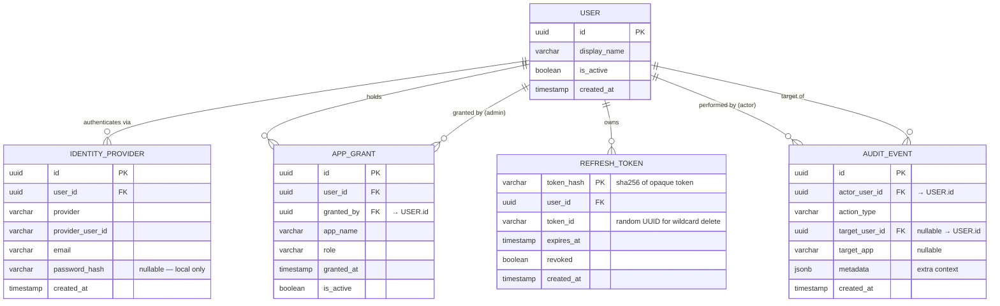

# Data Model: Centralised Auth Service

**Date**: 2026-05-09

---

## Entity-Relationship Diagram



---

## DDL

```sql
-- ============================================================
-- Users
-- ============================================================
CREATE TABLE users (
    id          UUID PRIMARY KEY DEFAULT gen_random_uuid(),
    display_name VARCHAR(255) NOT NULL,
    is_active   BOOLEAN NOT NULL DEFAULT TRUE,
    created_at  TIMESTAMPTZ NOT NULL DEFAULT NOW()
);

-- ============================================================
-- Identity providers
-- provider: 'google' | 'microsoft' | 'local'
-- provider_user_id: sub from OAuth id_token (NULL for local)
-- password_hash: bcrypt hash (NULL for OAuth accounts)
-- ============================================================
CREATE TABLE identity_providers (
    id               UUID PRIMARY KEY DEFAULT gen_random_uuid(),
    user_id          UUID NOT NULL REFERENCES users(id) ON DELETE CASCADE,
    provider         VARCHAR(32) NOT NULL,
    provider_user_id VARCHAR(255),
    email            VARCHAR(320) NOT NULL,
    password_hash    VARCHAR(72),  -- bcrypt max input length
    created_at       TIMESTAMPTZ NOT NULL DEFAULT NOW(),

    CONSTRAINT uq_provider_identity UNIQUE (provider, provider_user_id),
    CONSTRAINT uq_local_email UNIQUE (provider, email)
        DEFERRABLE INITIALLY DEFERRED
);

CREATE INDEX idx_identity_providers_user_id ON identity_providers(user_id);
CREATE INDEX idx_identity_providers_email ON identity_providers(email);

-- ============================================================
-- Application grants
-- role: 'user' | 'admin'
-- app_name: matches the string used in JWT grants[] claim
-- ============================================================
CREATE TABLE app_grants (
    id          UUID PRIMARY KEY DEFAULT gen_random_uuid(),
    user_id     UUID NOT NULL REFERENCES users(id) ON DELETE CASCADE,
    granted_by  UUID REFERENCES users(id) ON DELETE SET NULL,
    app_name    VARCHAR(64) NOT NULL,
    role        VARCHAR(32) NOT NULL DEFAULT 'user',
    granted_at  TIMESTAMPTZ NOT NULL DEFAULT NOW(),
    is_active   BOOLEAN NOT NULL DEFAULT TRUE,

    CONSTRAINT uq_user_app_grant UNIQUE (user_id, app_name)
);

CREATE INDEX idx_app_grants_user_id ON app_grants(user_id);
CREATE INDEX idx_app_grants_app_name ON app_grants(app_name);

-- ============================================================
-- Refresh tokens
--
-- AUTHORITATIVE STORE: Redis (key: rt:{user_id}:{token_id}, TTL 30d)
-- Redis is the single source of truth for validity checks and rotation.
--
-- POSTGRES ROLE: Non-authoritative audit log only.
-- Writes to this table are best-effort (async, fire-and-forget).
-- A Postgres write failure MUST NOT prevent token issuance.
-- A discrepancy between Redis and Postgres is expected and acceptable.
-- Queries for "what refresh tokens are active" MUST use Redis, not Postgres.
--
-- token_hash: sha256(opaque_token) as hex string
-- token_id: random UUID — matches Redis key suffix rt:{user_id}:{token_id}
-- ============================================================
CREATE TABLE refresh_tokens (
    token_hash  CHAR(64) PRIMARY KEY,   -- sha256 hex
    user_id     UUID NOT NULL REFERENCES users(id) ON DELETE CASCADE,
    token_id    UUID NOT NULL DEFAULT gen_random_uuid(),
    expires_at  TIMESTAMPTZ NOT NULL,
    revoked     BOOLEAN NOT NULL DEFAULT FALSE,
    created_at  TIMESTAMPTZ NOT NULL DEFAULT NOW()
);

CREATE INDEX idx_refresh_tokens_user_id ON refresh_tokens(user_id);

-- ============================================================
-- Audit events (append-only — no UPDATE or DELETE allowed)
-- action_type: 'grant_created' | 'grant_revoked' | 'user_created'
--              | 'user_deactivated' | 'login_success' | 'login_failed'
--              | 'token_revoked_all'
-- ============================================================
CREATE TABLE audit_events (
    id              UUID PRIMARY KEY DEFAULT gen_random_uuid(),
    actor_user_id   UUID REFERENCES users(id) ON DELETE SET NULL,
    action_type     VARCHAR(64) NOT NULL,
    target_user_id  UUID REFERENCES users(id) ON DELETE SET NULL,
    target_app      VARCHAR(64),
    metadata        JSONB,
    created_at      TIMESTAMPTZ NOT NULL DEFAULT NOW()
);

CREATE INDEX idx_audit_events_actor ON audit_events(actor_user_id);
CREATE INDEX idx_audit_events_target ON audit_events(target_user_id);
CREATE INDEX idx_audit_events_created_at ON audit_events(created_at DESC);
```

---

## Enum Values

### `identity_providers.provider`
| Value | Description |
|-------|-------------|
| `google` | Google OIDC |
| `microsoft` | Microsoft OIDC |
| `local` | Username + password (bcrypt) |

### `app_grants.role`
| Value | Description |
|-------|-------------|
| `user` | Standard app access |
| `admin` | Platform admin (for `app_name = "admin"`) |

### `audit_events.action_type`
| Value | Trigger |
|-------|---------|
| `user_created` | New user registered (OAuth or password) |
| `user_deactivated` | Admin deactivates a user |
| `grant_created` | Admin grants app access to user |
| `grant_revoked` | Admin revokes app access from user |
| `login_success` | Successful authentication |
| `login_failed` | Failed login attempt |
| `token_revoked_all` | All sessions revoked (reuse detection or admin action) |

---

## Redis Key Schema

| Key pattern | Value | TTL | Purpose |
|-------------|-------|-----|---------|
| `rt:{user_id}:{token_id}` | `1` | 30 days | Refresh token existence check |
| `oauth_state:{state}` | `{code_verifier}\|{redirect_uri}` | 10 min | OAuth PKCE state |
| `rl:login:{ip}` | counter | 60 s | Rate limit: login by IP |
| `rl:refresh:{user_id}` | counter | 60 s | Rate limit: token refresh by user |
| `lockout:{user_id}` | `1` | 5 min | Account lockout after failed logins |
